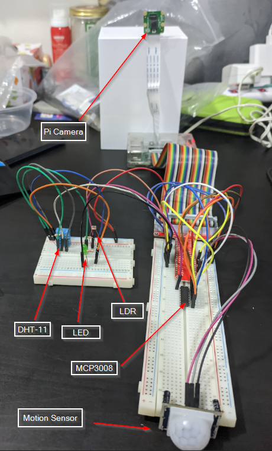

# IOT-CA2
IOT CA2 Repo for Poh Chuan and Zhao Bin, Team: The New Meta
## System hardware

## Quick Start Guide
1. Firstly connect the hardware as shown in the Section 2 of the step-by-step tutorial.
2. Install all packages as instructed in Section 3 of the step-by-step tutorial.
3. Run "git clone https://github.com/Zerolegacy/IotCA2"
4. Ensure that all the AWS features are configured and the ~/.aws/credentials file is created
5. Ensure all the AWS Certificates and keys are located in the same directory as the server.py and other python files.
6. Make sure that you have updated the AWS certificates and keys to your own pair.
7. Change the twilio account id and auth-token to your own.
8. Update the endpoint API link inside ldr-mqtt.py as well as server.py
9. Update bucket name in detect_motion.py.
10. Run server.py for the flask server.
11. Run ldr-mqtt.py for getting and uploading ldr values to DynamoDB.
12. Control the application through the web interface on http://<ip of raspberry pi>:8001/